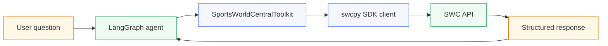
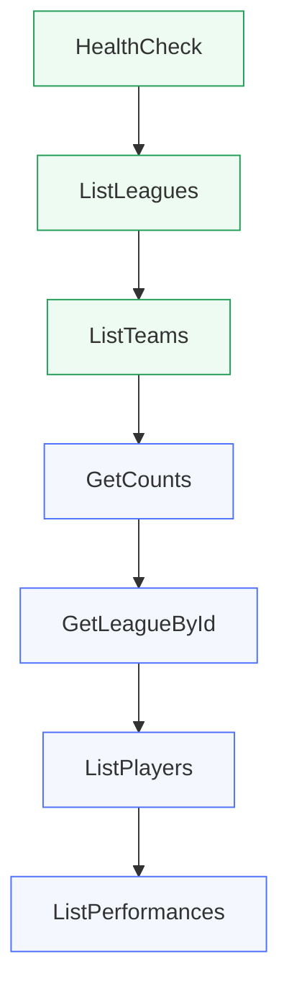

# Calling APIs with LangChain

This project shows how to wrap the SportsWorldCentral fantasy football API with LangChain tools and use them inside a LangGraph agent. It turns a standard REST API into a tool-enabled workflow that an LLM can call for health checks, league lookups, team queries, player searches, and performance data.

## Project Overview

The toolkit is built in `swc_toolkit.py` and uses the `swcpy` SDK under the hood. Each LangChain tool validates its inputs with Pydantic, calls the API through a shared client, and returns data that can be used by an agent or notebook workflow.

The toolkit is designed for two goals:

- provide a clean interface between LangChain and the SWC API
- make it easy for an agent to answer fantasy football questions with live data

## What’s Included

- `swc_toolkit.py` - LangChain toolkit and tool definitions
- `langgraph_notebook.ipynb` - notebook for using the original toolkit
- `langgraph_notebook_with_toolkit.ipynb` - notebook prepared for the expanded toolkit
- `TOOLKIT_EXPANSION.md` - detailed implementation notes
- `TOOLKIT_QUICK_REFERENCE.md` - compact reference for the seven tools
- `requirements.txt` - Python dependencies

## Architecture



## Toolkit Expansion

The toolkit grew from 3 tools to 7 tools.



### Core Tools

- `HealthCheck` - check whether the API is running
- `ListLeagues` - retrieve leagues, optionally filtered by name
- `ListTeams` - retrieve teams, optionally filtered by team name or league ID

### Expanded Tools

- `GetCounts` - summarize the number of leagues, teams, and players
- `GetLeagueById` - retrieve a single league by ID
- `ListPlayers` - search players by first name, last name, or position
- `ListPerformances` - retrieve fantasy player performance data with a configurable limit

## How It Works

1. The notebook or agent sends a question to LangGraph.
2. LangGraph binds the tools from `SportsWorldCentralToolkit` to the model.
3. The model chooses the right tool based on the user request.
4. The tool validates inputs with a Pydantic schema.
5. The tool calls the SWC API through `local_swc_client`.
6. The API response is returned to the agent and used to answer the user.

## Environment Setup

The toolkit expects the SWC API base URL to be available as an environment variable.

```bash
SWC_API_BASE_URL=https://your-api-url
```

The value is loaded with `dotenv` and passed into `SWCConfig` when the toolkit initializes.

## Running The Notebook

Install the dependencies:

```bash
pip install -r requirements.txt
```

Open one of the notebooks:

- `langgraph_notebook.ipynb`
- `langgraph_notebook_with_toolkit.ipynb`

## Example Agent Questions

The expanded toolkit supports questions like:

- What leagues are available?
- Show me all players with position QB.
- List teams from league 1.
- Get the latest player performances.
- How many teams and players are in the system?

## Key Design Choices

- Each tool has its own Pydantic input model for validation.
- The toolkit uses a single shared `SWCClient` instance.
- Tool names and descriptions are written so the agent can choose the right action.
- The expanded toolkit keeps the same pattern as the original version, which makes it easy to extend.

## Reference Material

- [Toolkit Expansion](TOOLKIT_EXPANSION.md)
- [Quick Reference](TOOLKIT_QUICK_REFERENCE.md)
- [LangGraph Notebook](langgraph_notebook_with_toolkit.ipynb)

## Project Summary

This folder documents how to connect LangChain and LangGraph to a real fantasy football API. It demonstrates tool design, schema validation, SDK-based API access, and agent integration in a way that can be reused for other data-backed applications.
