# Fantasy Acquisition Model API

An end-to-end portfolio project for fantasy football analytics that turns a trained machine learning model into a deployable FastAPI service. The application predicts player acquisition cost ranges from a small feature set and returns a low, median, and high estimate so the result is useful for real decision-making, not just model scoring.

## Project Story

This project started as a model training exercise and grew into a production-style API. The goal was to package a set of ONNX models behind a clean interface that can be tested, documented, and deployed like a real ML service.

The result is a focused portfolio piece that shows the full path from data to inference:

- train the model on historical fantasy football data
- export the model to ONNX for efficient inference
- define validation schemas with Pydantic
- expose the model through FastAPI
- serve predictions through a simple API contract

## What This Project Includes

- `main.py` - FastAPI application and prediction logic
- `schemas.py` - input and output validation models
- `acquisition_model_10.onnx` - 10th percentile prediction model
- `acquisition_model_50.onnx` - 50th percentile prediction model
- `acquisition_model_90.onnx` - 90th percentile prediction model
- `player_training_data_full.csv` - training dataset used to build the models
- `player_acquisition_model.ipynb` - notebook used to explore and train the model
- `requirements.txt` - runtime dependencies

## Architecture

The architecture is intentionally simple and portfolio-friendly:

```mermaid
flowchart LR
	subgraph T[Training Pipeline]
		direction LR
		A[Player training data] --> B[Model training notebook]
		B --> C[Exported ONNX models]
	end

	subgraph S[Serving Pipeline]
		direction LR
		D[FastAPI service] --> E[Pydantic validation]
		E --> F[ONNX Runtime inference]
		F --> G[Prediction response]
	end

	C --> D

	style A fill:#f5f7ff,stroke:#4c6fff,stroke-width:1px
	style B fill:#f5f7ff,stroke:#4c6fff,stroke-width:1px
	style C fill:#f5f7ff,stroke:#4c6fff,stroke-width:1px
	style D fill:#eefbf3,stroke:#1f9d55,stroke-width:1px
	style E fill:#eefbf3,stroke:#1f9d55,stroke-width:1px
	style F fill:#eefbf3,stroke:#1f9d55,stroke-width:1px
	style G fill:#fff8e7,stroke:#d97706,stroke-width:1px
	style T fill:#fafafa,stroke:#cbd5e1,stroke-width:1px,stroke-dasharray: 4 4
	style S fill:#fafafa,stroke:#cbd5e1,stroke-width:1px,stroke-dasharray: 4 4
```



### Runtime Flow

1. A user sends feature values to `POST /predict/`.
2. Pydantic validates the request payload.
3. The API converts the inputs into a NumPy array.
4. ONNX Runtime runs inference against three model checkpoints.
5. The service returns a prediction band instead of a single score.

### API Surface

- `GET /` - health check for the service
- `POST /predict/` - returns acquisition cost estimates

### Input Fields

- `waiver_value_tier`
- `fantasy_regular_season_weeks_remaining`
- `league_budget_pct_remaining`

### Output Fields

- `winning_bid_10th_percentile`
- `winning_bid_50th_percentile`
- `winning_bid_90th_percentile`

## Screenshots

This section is ready for portfolio screenshots once you add image files to the folder.

Recommended screenshots:

- Model training notebook showing feature engineering and model export
- FastAPI docs page with the `predict` endpoint
- Example API request and response in a REST client
- The three ONNX model files or the project folder layout

Suggested filenames:

- `notebook.png`
- `api-docs.png`
- `prediction-response.png`
- `project-structure.png`

## Why It Matters

Most machine learning demos stop at a notebook. This project goes a step further and shows how to turn a trained model into a usable service with input validation, repeatable inference, and a clean interface. That makes it a stronger portfolio artifact because it demonstrates both model work and software delivery.

## Example Request

```json
{
  "waiver_value_tier": 3,
  "fantasy_regular_season_weeks_remaining": 5,
  "league_budget_pct_remaining": 40
}
```

## Example Response

```json
{
  "winning_bid_10th_percentile": 12.5,
  "winning_bid_50th_percentile": 18.0,
  "winning_bid_90th_percentile": 24.75
}
```

## Local Setup

Install the dependencies:

```bash
pip install -r requirements.txt
```

Run the service:

```bash
fastapi run main.py
```

or:

```bash
uvicorn main:app --reload
```

## Model Notes

The API loads three separate ONNX inference sessions so it can return a range of predicted acquisition costs. That approach is useful in fantasy football, where a single exact number is less valuable than an estimate band.

Keep the `.onnx` files in the same directory as `main.py` so the service can load them at startup.

## Portfolio Summary

This project demonstrates:

- machine learning model packaging
- API design with FastAPI
- input/output validation with Pydantic
- ONNX-based inference
- documentation for real-world usage

It is a compact but complete example of how to move from a trained model to a usable application.
